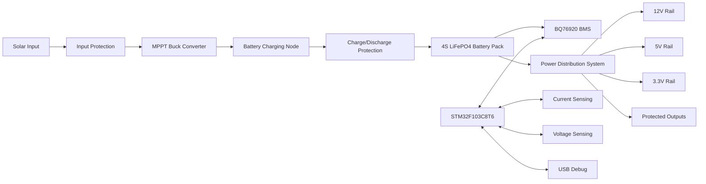
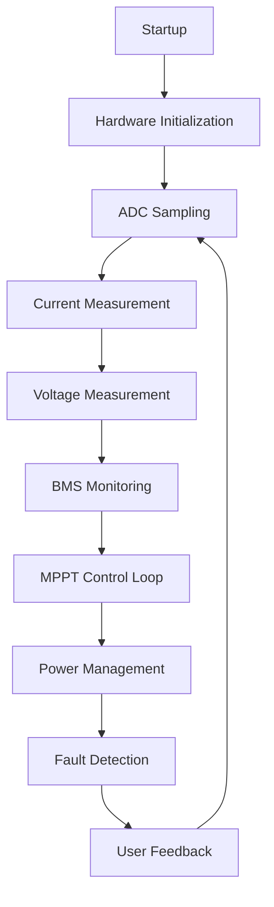

# Solar Energy Harvesting and Battery Management Platform (STM32)  
## SolarCore-4S MPPT Power Management System

## 1. Project Banner


---

## 2. Project Overview

SolarCore-4S MPPT Power Management System is an embedded power electronics platform focused on solar energy harvesting, battery charging, battery management, and protected multi-rail power distribution. The design integrates a dedicated embedded control node based on **STM32F103C8T6**, a **BQ76920** battery management subsystem for 4S LiFePO4 supervision, and supporting power-stage/control interfaces for charge-discharge path management.

The platform architecture is modular at schematic and PCB level, enabling clear partitioning of solar input conditioning, MPPT-oriented conversion stages, battery protection, sensing, and regulated output distribution. The hardware has been developed through a professional PCB workflow in **Altium Designer**, including completed schematic capture, 4-layer layout, and Draftsman documentation generation.  

This repository documents the hardware architecture and design workflow. Hardware manufacturing and validation are pending.

---

## 3. Key Features

| Feature | Description |
|---|---|
| MPPT Energy Harvesting | Solar input processing architecture prepared for MPPT-driven energy extraction workflow |
| STM32 Control | Central embedded supervision and control using STM32F103C8T6 |
| 4S LiFePO4 Monitoring | Multi-cell battery stack monitoring architecture for 4S LiFePO4 systems |
| BQ76920 Protection | Cell monitoring and protection support through BQ76920 BMS IC |
| Charge/Discharge Control | Dedicated charge and discharge path control stages in hardware |
| Protected Outputs | Output connectors include protection-focused design intent |
| Power Distribution | Multi-rail distribution strategy for downstream loads |
| USB-C Debug Interface | USB Type-C debug/programming interface via CP2102N USB-UART bridge |
| Battery Monitoring | Voltage/current observation paths for embedded diagnostics |
| 4 Layer PCB Design | Layered signal-power-ground architecture for improved layout control |
| Draftsman Documentation | Formal assembly and fabrication-oriented documentation generated |
| Manufacturing Package Generation | Manufacturing outputs prepared (Gerber, NC drill, BOM, and related files) |

---

## 4. System Architecture



---

## 5. Hardware Architecture Overview

The hardware is partitioned into functionally distinct yet electrically integrated subsystems:

- **Solar Input Subsystem**  
  Accepts photovoltaic input and routes energy through front-end protection and conditioning stages before converter entry.

- **MPPT Subsystem**  
  Implements the hardware path required for MPPT-controlled conversion and battery charging node regulation.

- **Current Sensing Subsystem**  
  Provides analog/current feedback paths for embedded measurement and control-loop observability.

- **Voltage Sensing Subsystem**  
  Enables monitored voltage points across input, battery, and distribution nodes for supervisory logic.

- **Battery Protection Subsystem**  
  Uses BQ76920-centric monitoring/protection architecture for a 4S LiFePO4 pack context.

- **Power Switching Subsystem**  
  Controls charge/discharge path gating and operating-state transitions through dedicated switching stages.

- **Power Distribution Subsystem**  
  Distributes stored energy into required system rails and protected load outputs.

- **Output Protection Subsystem**  
  Integrates protective output routing strategy for external interfaces and load-side safety.

- **USB Debug Subsystem**  
  CP2102N-based USB-UART communication interface for firmware debug/programming workflow.

- **Embedded Controller Subsystem**  
  STM32F103C8T6 supervises sensing, BMS communication, and control sequencing at system level.

---

## 6. Complete Schematic Documentation

### Sheet 1 – System Architecture

IMAGE_PLACEHOLDER_SYSTEM_ARCHITECTURE

- **What it does:** Defines top-level electrical partitioning and subsystem interconnections.  
- **How it connects:** Serves as the integration map linking energy path, control path, sensing path, and interfaces.  
- **Important components:** System-level interconnect blocks, power path references, controller interaction boundaries.  
- **Why it exists:** Establishes traceable architecture before detailed per-sheet implementation.

### Sheet 2 – STM32 Controller and Monitoring System

IMAGE_PLACEHOLDER_STM32_CONTROLLER

- **What it does:** Implements the STM32F103C8T6 control core and measurement interface endpoints.  
- **How it connects:** Interfaces with sensing networks, BMS communication paths, and debug/programming ports.  
- **Important components:** STM32F103C8T6, analog acquisition interfaces, communication lines, support passives.  
- **Why it exists:** Centralizes supervisory control and monitoring signal acquisition.

### Sheet 3 – 4S LiFePO4 Battery Management System (BMS)

IMAGE_PLACEHOLDER_BMS

- **What it does:** Defines multi-cell monitoring and battery protection topology for 4S LiFePO4.  
- **How it connects:** Ties directly to the battery stack and exchanges status/control data with the controller domain.  
- **Important components:** BQ76920 and associated sensing/protection support network.  
- **Why it exists:** Provides battery safety monitoring architecture and protected battery operation framework.

### Sheet 4 – Charge and Discharge Protection Stage

IMAGE_PLACEHOLDER_POWER_SWITCH

- **What it does:** Implements controlled charge/discharge path switching and protection behavior.  
- **How it connects:** Sits between charging node, battery pack, and downstream distribution interfaces.  
- **Important components:** IR2104-based drive/control elements and switching-stage support circuitry.  
- **Why it exists:** Enables controlled energy flow while enforcing protection-focused operating transitions.

### Sheet 5 – Output Connectors and Protection

IMAGE_PLACEHOLDER_OUTPUT_CONNECTORS

- **What it does:** Defines external output connectors and protection elements for load interfacing.  
- **How it connects:** Receives power from distribution rails and routes to protected output endpoints.  
- **Important components:** Output connectors, protection devices, interface conditioning components.  
- **Why it exists:** Standardizes safe external power access points.

### Sheet 6 – Power Distribution and Voltage Rails

IMAGE_PLACEHOLDER_POWER_DISTRIBUTION

- **What it does:** Implements rail generation/distribution strategy for system and external loads.  
- **How it connects:** Receives upstream battery-sourced power and feeds 12V, 5V, and 3.3V domains.  
- **Important components:** LM3478-related control/distribution stage and rail routing support circuitry.  
- **Why it exists:** Provides organized multi-rail power availability across platform domains.

### Sheet 7 – USB Type-C Debug and Programming Interface

IMAGE_PLACEHOLDER_USB_DEBUG

- **What it does:** Provides USB Type-C based debug/programming communication access.  
- **How it connects:** Bridges USB interface to MCU UART/debug domain through CP2102N.  
- **Important components:** CP2102N, USB Type-C connector, protection/interface passives.  
- **Why it exists:** Supports embedded development workflow and diagnostics without dedicated external adapters.

---

## 7. PCB Design Overview

The PCB is implemented as a **4-layer stackup** in Altium Designer:

| Layer | Function |
|---|---|
| Layer 1 | Top Signal |
| Layer 2 | Ground Plane |
| Layer 3 | Power Plane |
| Layer 4 | Bottom Signal |

Design strategy emphasizes:

- **Power integrity:** Controlled distribution over dedicated power plane regions and short high-current paths.  
- **Ground return paths:** Continuous ground reference on Layer 2 to reduce loop area and improve return continuity.  
- **Noise control:** Functional zoning between switching power stages, analog sensing, and controller/debug sections.  
- **Power distribution:** Structured rail routing from battery/power stages to 12V, 5V, and 3.3V destinations.  
- **Thermal considerations:** Copper utilization and via-based heat spreading around power-dense regions.  
- **Placement methodology:** Source-to-load path minimization and subsystem clustering by function.

---

## 8. PCB Layout Strategy

- **Power stage placement:** Converter and switching stages positioned to minimize high-di/dt loop lengths.  
- **Controller placement:** STM32 and monitoring circuits placed in a lower-noise control region.  
- **BMS placement:** BQ76920 and cell monitoring network grouped for short, coherent battery sense routing.  
- **USB placement:** USB Type-C and CP2102N placed for clean interface routing and practical access.  
- **Connector placement:** Power/output connectors arranged for clear current flow and service accessibility.  
- **Routing methodology:** Hierarchical routing from high-power nets first, followed by control/analog interfaces.  
- **Grounding strategy:** Ground-plane continuity maintained with deliberate partition-aware return management.  
- **Thermal vias:** Used near thermally active components to improve heat transfer into internal copper.  
- **Power planes:** Layer 3 segmented/organized to support multiple voltage domains and controlled distribution.  
- **Manufacturability considerations:** Clearances, drill constraints, and assembly access considered during layout finalization.

---

## 9. PCB Images

## PCB Top View

IMAGE_PLACEHOLDER_PCB_TOP

Top-side view showing component distribution, power-stage zoning, and control-domain placement.

## PCB Bottom View

IMAGE_PLACEHOLDER_PCB_BOTTOM

Bottom-side view highlighting complementary routing channels, plane interactions, and connector breakout strategy.

## PCB Perspective View

IMAGE_PLACEHOLDER_PCB_PERSPECTIVE

Perspective rendering for holistic visualization of mechanical placement balance and subsystem segregation.

---

## 10. Draftsman Documentation

## Assembly Drawing

IMAGE_PLACEHOLDER_DRAFTSMAN_ASSEMBLY

Documents component references, placement orientation, and assembly guidance for board population workflow.

## Layer Documentation

IMAGE_PLACEHOLDER_DRAFTSMAN_LAYERS

Provides per-layer visual references and stack representation to support fabrication and design review.

## Manufacturing Documentation

IMAGE_PLACEHOLDER_DRAFTSMAN_MANUFACTURING

Consolidates production-facing notes, callouts, and output package references for fabrication handoff.

---

## 11. Manufacturing Outputs

| Output | Status |
|---|---|
| Gerbers | Generated |
| NC Drill Files | Generated |
| Assembly Drawings | Generated |
| Fabrication Drawings | Generated |
| BOM | Generated |
| Pick and Place Data | Generated |
| PCB PDF | Generated |
| Schematic PDF | Generated |

---

## 12. Firmware Architecture



---

## 13. Firmware Workflow

- **STM32 role:** Central execution node for supervisory logic and subsystem coordination.  
- **ADC acquisition:** Periodic analog sampling for operational observability.  
- **Current sensing:** Charge/discharge path current data is acquired for control and protection context.  
- **Voltage sensing:** Battery/system voltages are monitored for state supervision.  
- **BMS communication:** Controller interfaces with BMS telemetry/protection information paths.  
- **Battery monitoring:** Multi-parameter battery condition tracking supports safe workflow decisions.  
- **Fault management:** Fault checks gate protective responses and user-visible status handling.  
- **Future MPPT implementation:** Control algorithm refinement and hardware-coupled tuning are planned after bring-up.

---

## 14. Repository Structure

```text
SolarCore-4S MPPT Power Management System/
├── Docs/
├── Hardware/
├── PCB/
├── Schematics/
├── Draftsman/
├── Firmware/
├── Manufacturing/
├── Images/
└── BOM/
```

---

## 15. Design Highlights

| Area | Implementation |
|---|---|
| Controller | STM32F103C8T6 |
| Battery Management | BQ76920 |
| Gate Drive | IR2104 |
| Power Distribution Control | LM3478 |
| USB-UART Interface | CP2102N |
| PCB Technology | 4-Layer PCB |
| Distribution Topology | Multi-rail protected power distribution |
| Debug Interface | USB Type-C debug/programming path |

---

## 16. Future Development

The following activities are planned for subsequent project phases:

- PCB manufacturing and fabrication release execution  
- Hardware assembly and staged bring-up  
- Firmware development completion and integration  
- MPPT functional validation on manufactured hardware  
- Thermal characterization under defined operating scenarios  
- Efficiency measurements across representative load/input conditions  
- System-level optimization based on bring-up and validation results

---

## 17. Project Status

- [x] System Architecture
- [x] Schematic Design
- [x] PCB Layout
- [x] Draftsman Documentation
- [x] Manufacturing Files
- [ ] PCB Fabrication
- [ ] Assembly
- [ ] Firmware Development
- [ ] Hardware Bring-Up
- [ ] Validation Testing

> Current status: Hardware design artifacts are complete; manufacturing and hardware validation are pending.

---

## 18. License

This project is licensed under **CC BY-NC-ND 4.0**.

---

## 19. Author

**Yukesh S**  
Embedded Systems and PCB Design Enthusiast
